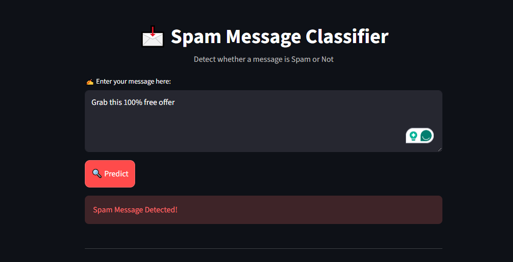

# 📩 Spam Message Classifier

A Machine Learning project that classifies messages as **Spam** or **Not Spam (Ham)** using NLP techniques.

---

## 🚀 Features

- Detects spam messages in real-time
- Built using Machine Learning (Naive Bayes)
- Uses NLP (TF-IDF Vectorization)
- Interactive UI using Streamlit

---

## 🧠 Tech Stack

- Python
- Pandas
- Scikit-learn
- Streamlit

---

## 📊 Model Details

- Algorithm: Multinomial Naive Bayes
- Vectorization: TF-IDF
- Accuracy: ~98%

---

## ▶️ Run Locally

```bash
pip install -r requirements.txt
python -m streamlit run src/app.py

## 📸 Screenshot

